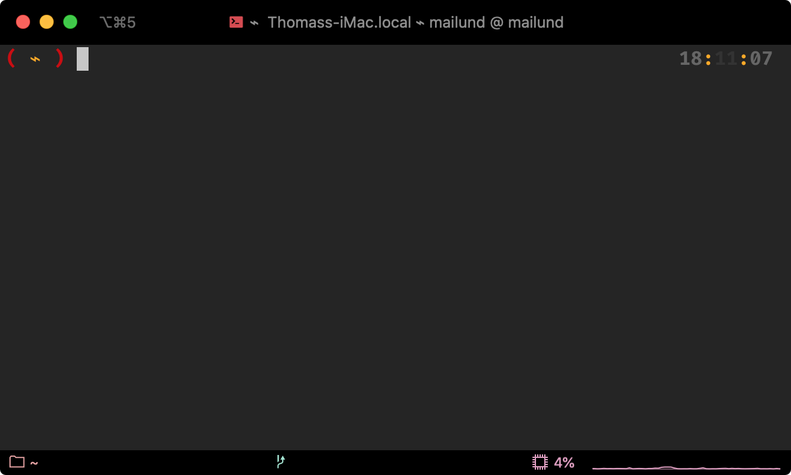
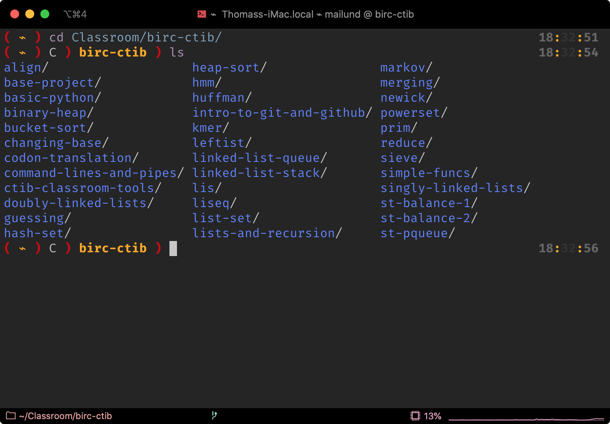
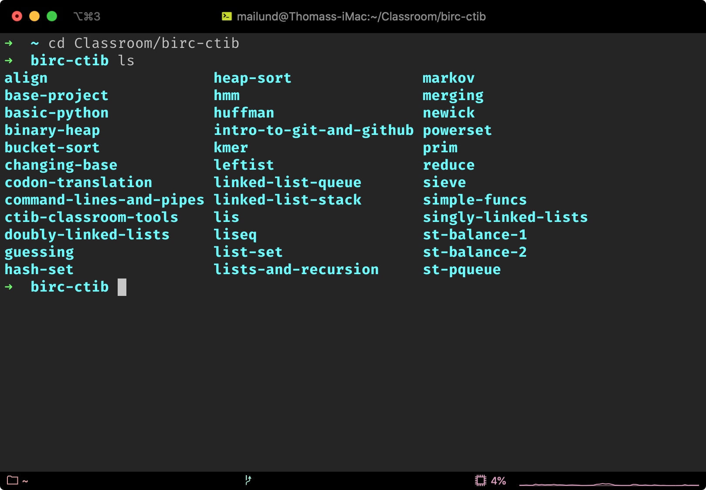
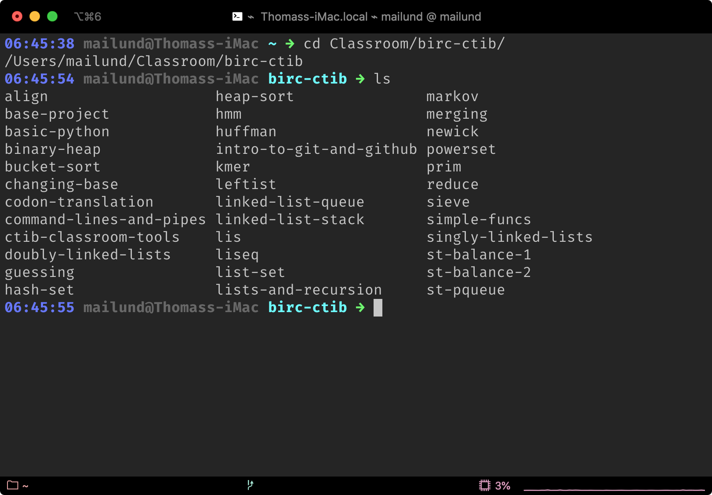
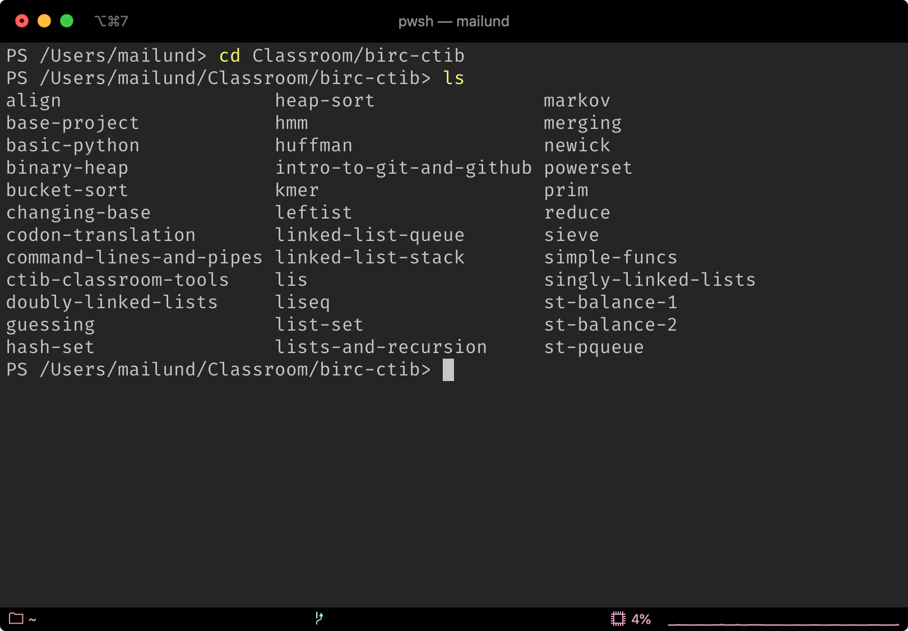
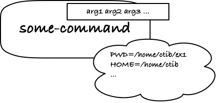
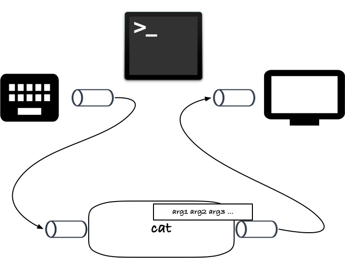
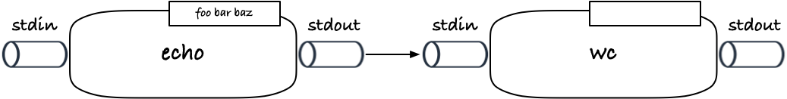

# A (very) quick and (very) dirty introduction to the UNIX command line

This class is not about the UNIX environment and the UNIX command line[^1]—we have another class for that—but knowing how a command line works and what the components of it are is an essential skill for any serious use of computers in a scientific setting. Textual interfaces where you can combine different tools in a consistent way has time and time again proven to be a more flexible and versatile than the graphical user interfaces you might be familiar with from desktop computing, and the UNIX command line provides a powerful framework for this, based on a few simple ideas.

The ideas are simple, at least. There is a bit of a learning curve if  your computational background is desktop computers. However, once you grasp the basic ideas the rest will follow over time.

When you write your own programs, they will usually have to fit into this command line environment. The purpose of this exercise is to understand the UNIX command line well enough that we can write programs that play well with other command line tools. Luckily, this doesn't require that we first master the command line, understanding the much simpler underlying ideas suffices.

In the following we shall explore the basic anatomy of a command line tool and see how we can combine tools if they are written with the command line in mind. We will do this with various examples of command line tools and so-called "pipelines". We will only see a small subset of the tools you will have available in an UNIX-like environment, and only see a tiny fraction of what these tools can do. The point is not to become experts in the different tools—that can come later—but how the “language” of the command line can combine tools. The examples are simply teasers for what you might be able to do with the tools, if you explore them further.


## The terminal and the shell

First, let’s get you a UNIX shell and a terminal. If you are running Linux or macOS, you already have a UNIX system—both operating systems are UNIX variants—but if you are running Windows you will not have a UNIX environment by default. Not to worry, you can install one. [WSL](https://docs.microsoft.com/en-us/windows/wsl/install) or [MobaXterm](https://mobaxterm.mobatek.net) will give you a virtual machine running Linux, for example. But for these exercises, we do not need a full UNIX environment, and the [PowerShell](https://docs.microsoft.com/en-us/powershell/), that I am told is getting popular, will do just fine.

I don’t have any experience with running UNIX on Windows, as I haven’t used Windows since the last century, so I will trust that you can work out yourself how to get a working version up and running if you want to go for that solution. If you decide to use PowerShell, I have checked that all the examples should run. I will have to defer to [elsewhere for how to start it, though](https://www.howtogeek.com/662611/9-ways-to-open-powershell-in-windows-10/).

Ok, from now on, I will assume that you can start a terminal. What you will see depends on your system and countless setup parameters, but when I open a shell, I get a window that looks like this:



What you will see can look quite different, because much of what we are seeing can be configured according to personal taste.

What we have here is actually two separate programs, a *terminal* and a *shell*. The two tend to merge when we talk about them, but they are separate things. One, the *terminal*, is the window you see on your computer’s desktop. It is responsible for displaying text and for handling input from you when you type on your keyboard. The name “terminal” refers back to the Elder Days where you only communicated with your computer through a keyboard and a green on black screen. The hardware was there terminal. Things have changed, so now you have a window on your screen instead that does the same as the hardware used to do, and the program that handles that inherited the name *terminal*.

The difference between terminals is mostly cosmetic; they provide different types of eye candy, but rarely different functionality. Sometimes a little, and the terminal I use, [iTerm](https://iterm2.com) has some features that I quite like, but it is very rare that the choice of terminal matters the slightest. Use whatever default terminal you have, and it will be a long while before you need to consider alternatives.

The other program, the *shell*, is the one that is doing the real work. The terminal gives the shell all the text you write, then the shell does what it does with it and provides a result, that the terminal then displays.

When you type in commands, the shell will parse the commands you give it and execute programs according to the instructions you gave it. Since it is up to the shell to interpret what you write, the choice of shell matters more than the choice of terminal. Different shells have different syntax—they give you small languages to provide the computer with instructions in—but the different shell (languages) have roughly the same features and for a novice, it doesn’t matter which shell you use. When you get to where you write more complicated commands, or where you start programming in the shell language, it will matter, but for now it doesn’t.

The shell I’ve been using the last couple of years is called [fish](https://fishshell.com). I find it useful for interactive work with the computer. For programming, I tend to use [bash](https://www.gnu.org/software/bash/) instead, though. If you are on macOS or Linux, the default shell is probably bash. It will also be the default for some of the Windows solutions, but if you installed PowerShell, the shell is (you guessed it) PowerShell.

Below you can see the same commands in three different shells, fish, [zsh](https://www.zsh.org), bash and PowerShell, respectively. As you can see they all look a little different, but you can configure all of them to look completely different so you shouldn't put too much into that. The four images show the same commands in the different shells, first I change directory `cd` to `Classroom/birc-ctib` and then I list `ls` the files there.









The basic interaction with all shells involves typing something into a *prompt*. The prompt on all the figures is to the left of the cursor, the big rectangular block you can see on the last line (it isn't there on the lines where the shell has already evaluated a command). Prompts can be configured, so below I will use `$` as the example prompt, but keep in mind that it will look different on your computer.

When you interact with your shell, you write a command at the prompt and then hit ENTER. (This should be familiar to most of you). Then the shell will interpret what you wrote, execute the command you gave it, and print the result.

How this work, in some more detail, is what we will learn in this exercise, but first, we will look at a few example commands.

## A few useful commands

This will not be a tutorial of most useful commands you will want to know, you will pick those up with time if explore the UNIX environment as you work on exercises and projects, but I will show you a few to get you started.

### man

The most useful command to know is `man`, short for *manual*. This is where you get information about the tools you have. If you write

```sh
$ man man
```

you get the manual for the `man` command.

Back in the good old days, all tools would have a manual page that described them, and all the old tools still do. Unfortunately, this isn’t true for many modern bioinformatics tools, where you have to run the tool with a flag such as `-h` or `--help` to get the same information, but that is a worry for another day. For the commands I will show you in this exercise, `man` will give you a description. Use this command to learn more about the various tools and commands.

### ls

The `ls` command you saw in the examples above lists the files in a directory. Try the command

```sh
$ man ls
```

You will find that the command takes an unreasonable number of options. The exact options depend a bit on which platform you are on, but there will be more than you care to study right now on all platforms. On my machine, the options are

```
ls [-ABCFGHLOPRSTUW@abcdefghiklmnopqrstuwx1%] [file ...]
```

where the long line `[-ABCFGHLOPRSTUW@abcdefghiklmnopqrstuwx1%]` are all the options. Ignore them. The important part is `ls [file ...]`. This bit tells you that `ls` takes zero or more files as arguments. Zero or more because `file ...` is in `[…]` which means that they can be left out and “more” because of the ellipsis after `file`.

We used it without arguments above

```sh
$ ls
```

and if we do this, it will list the current directory. (More on that shortly).

If you give it options, which will typically be directories, it will list those. So

```sh
$ ls foo
```

will list the file or directory `foo`. If `foo` is a file, it will just list `foo`, and if `foo` is a directory it will list all the files in it.

### mkdir, touch and rm

Try running these commands:

```sh
$ mkdir foo
$ touch foo/bar
$ touch foo/baz
$ ls foo
```

What do you see?

Use `man mkdir` to find out what `mkdir` does.

(It creates a new directory).

Use `man touch` to see what `touch` does.

(It “touches” a file, which isn’t something we need here, but touching a file that doesn’t exist has the side-effect of creating it).

Why do you get the result you get when you run these commands?

If you want to remove a file, the command `rm` is what you need. However,

```sh
$ rm foo
```

won’t work for us here. Since `foo` is a directory, we cannot simply remove it the same way as we can a file. However,

```sh
$ rm -r foo
```

will do the trick. The option `-r` tells `rm` to remove files recursively, and then it will happily take a directory and remove it together with all files and directories inside it.

A command such as `rm -r foo` gives us a common pattern for instructions to a shell. The `rm` bit is a program that we want to run. The `foo` argument is an option to it, and the `-r` bit is a flag that modifies how the program is run. There are some conventions for how programs use flags and options and such, but unfortunately there is more than one convention, so you never really know how any given program handles arguments. That is up to the programmer who wrote the tool, and you have to check the documentation.

We will see how to write tools that take arguments, and how to parse the arguments as flags and options, in some of the later exercises and projects.

### echo

The command `echo` prints the arguments you give it:

```sh
$ echo foo bar baz
foo
bar
baz
```

Think of it as a simple “print” statement in a shell. When you are working interactively, it doesn’t seem like a terribly useful command, but it does have its usage.

If you write

```sh
$ echo foo bar baz > qux
```

you will have created a new file, `qux`, that contains the lines:

```
foo
bar
baz
```

The magic happens with the symbol `>`, and it isn’t actually `echo` doing the magic but the shell. When we write this, we redirect the output of the command to the left of `>` into the file on the right. We return to this in a little bit. 

### cat, more and less

The `cat` command con*cat*tenates files.

If you call `cat` with a number of files, it will print their content one after another. A number could be one, so you can write

```sh
$ cat qux
foo
bar
baz
```

to get the content of the file `qux` we created above. The same file can appear more than once, so you could also get:

```sh
$ cat qux qux
foo
bar
baz
foo
bar
baz
```

It is a useful command if you want to see the content of a small file, but if a file is large, you probably don’t want to get all of it printed. Instead you can get a view of it with the commands `more` or `less`. (The `less` command is an improved `more` and “`more` is `less`” is programmer humour).

Try running `more qux` and `less qux`.

If you read `man cat` you will see `[file ...]` in the command description, telling you that you can also call `cat` with zero files. If you do this, it will look like nothing is happening.

```sh
$ cat

```

but try writing something and hitting ENTER. It will echo what you just wrote. Write some more and hit ENTER again, and the same thing happen. When you grow tired of this you can hit `CTRL-d` to finish.

What happens is that `cat` reads from “standard input”. It takes over from the shell so all you write goes to `cat`, and everything you write will be echoed because that is what `cat` does—it prints each input line.

Just as you can send the output of a command to a file with `>` you can also tell a program that its “standard input” should be taken from a file. The symbol is then `<`. So

```sh
$ cat < qux
foo
bar
baz
```

in a UNIX shell will do the same as

```sh
$ cat qux
```

This, however, doesn’t work with PowerShell. We can get a similar effect in a different way, but we get to that later.

For `cat`, this isn’t useful in itself; we get exactly the same effect by calling `cat qux` as `cat < qux`, but it has its uses as we shall also see shortly.

### cmp and diff

If you want to see if two files are identical—you can probably imagine that this can be useful—two tools are particularly useful. The `cmp` command will tell you if two files are the same. It will print that they are different if they are

```sh
$ echo foo baz bar > qax
$ cmp qux qax
qux qax differ: char 7, line 2
```

or print nothing if they are the same:

```sh
$ cmp qux qux
```

Just because it doesn’t print anything doesn’t mean that the tool doesn’t return a value, it just isn’t printed. In PowerShell or bash you can get the status of a command using `echo $?`

```sh
$ cmp qux qux
$ echo $?
True
$ cmp qux qax
qux qax differ: char 7, line 2
$ echo $?
False
```

(PowerShell will write `True` or `False` while bash will write 0 for true and non-zero for false).

This is mostly useful for shell programming, which is beyond the scope of this class.

If you want to see the differences between two files, `diff` is your tool.

```sh
$ diff qux qux
$ diff qux qax
2d1
< bar
3a3
> bar
```

It will also print nothing if the files are identical—then there are no differences—and otherwise it will print the differences it see. You need to remove `bar` in the second line of `qux` and then add a `bar` at the third line to get `qax`. The way `diff` displays the differences can be changed with a plethora of options that you can learn about using `man diff`.

The `-y` option is particularly useful. It displays the two files next to each other with `<` when a line is present in the first file and not the second, and with `>` when something is present in the second file but not the first.

```sh
$ diff -y qux qax
foo     foo
bar   <
baz     baz
      > bar
```


### grep

The `grep` command lets you search in files. The name has a weird mnemonic, `grep` stands for “global, regular expression, print”, a name that made perfect sense in the Elder Days where it was a command you could give the `ed` editor, but today it is pure nonsense. Instead, `grep` has become a verb in its own right, and you will hear programmers talk about “grepping” for stuff.

The simplest usage is `grep word file` that will search for `word` in the file `file` and print all the lines where `word` is found.

A boring example is this:

```sh
$ grep foo qux
foo
```

It prints a single `foo` as there is one line in `qux` that contains `foo`.

If you search in more than one file, `grep` will also tell you which file it found `word` in.

```sh
$ grep foo qux qax
qux:foo
qax:foo
```

The countless options you can give `grep` can change how it outputs it findings, whether it prints the lines where it finds `word` or just which files it found `word` in, ,whether it should output the files it *didn’t* find `word` in instead, and so on. It is one of the most useful search commands you have at your disposal on the command line, once you learn how to use it.


## Navigating the file system

I won’t say much about the file system. You already know how the file system consist of a hierarchy of directories and files. The only thing to add to this, when it comes to shells, is that we have something called the *current (working) directory*, and all commands are relative to that place.

The command `pwd` will show you where the shell’s current working directory is. You get a string of `/`-separated names. The slash is used to separate directories on UNIX (you might be used to backslash on Windows). Whenever you provide a file-name to a command, it will be interpreted in one of two ways. 

An *absolute* path to the file—any file-name that starts with a `/` is absolute, and the path—the string of `/`-separated names is interpreted as starting in the root of your file system. What that is, depends on your platform.

A *relative* path is one that doesn’t start with a `/`. Those will be interpreted as a path that starts in the current working directory and relative to that.

So, when we wrote `cat qux` we used a relative path. We gave `cat` the `qux` file in the current directory. Earlier, when we did `touch foo/bar` we also used a relative path. We specified the directory `foo` in the current directory, and then the file `bar` inside that `foo` directory.

In addition to this, there are two special names, `.` and `..`. A single dot, `.`, always refers to the current directory. So if we wrote `cat ./qux` we would explicitly say that we wanted the `qux` in the current directory. There are some situations where it is necessary to specify `./qux` instead of `qux`, but we won’t go into that here.

The two dots, `..`, refers to the parent of a directory. If we wrote `cat ../foo` we would be looking for the `foo` file not in this directory but in the directory one up.

Try running these commands and see what you get:

```sh
$ ls .
$ ls ..
```

The two dots can be used inside a path, so if we wrote

```sh
$ mkdir foo
$ ls foo/..
```

we would ask `ls` to list the parent directory of `foo` (which would be the same as the current directory.

To change directories you use the command `cd`. It takes a path as an argument, so you can change the current directory to the sub-directory `foo` using

```sh
$ cd foo
```

the go back to the original directory with

```sh
$ cd ..
```

If you use `cd` with arguments, you will be send to your home directory, whatever that is. It depends on your platform, and it isn’t an important concept on a personal computer, but it is if you get an account on a shared system like our GenomeDK cluster. The home directory is the root of all your own files, kept separated from other users’ files.

Try using `cd` to move around the directory hierarchy, and every time you end up somewhere new, use `pwd` to see where the shell thinks that you are.

## Arguments, standard input, output, and error, and redirecting

I know that it all looks confusing and overwhelming at this point. You’ve seen a tiny fraction of the commands you have available in a shell, and all of them take an obscene number of options, and there is no way that you can remember the commands or the options. Luckily, with `man` you don’t have to remember the options, but if you don’t know the name of a command, `man` is of no use.

It *is* overwhelming; it *is* confusing. It is not just you. There *are* too many commands to remember, and every time someone writes a new tool, yourself included, there is one more command to add to the toolbox.

Have no fear, though. It is just like learning a new language. A new language contains tens or hundreds of thousands of words and you need to learn a lot of them before you can speak the language, and at least you have fewer words on the command line than in English, Swahili or Dutch.

The more you use the language, the more words you will learn, and soon you will speak a passable command line, if not yet completely fluent. The only thing you need to do to keep learning is to, whenever you want to do something, X, ask the question: “how do I do X in my shell?”. You can ask me, you can ask a friend, and Google is your friend if you have no others. Slowly but surely you will increase your vocabulary.

Luckily, the grammar is much simpler for a shell than a natural language. It is more complicated than I will show you here—and each shell is a separate language with its own grammar when it comes to the more complicated stuff—but it is simpler than the natural languages you already speak.

I will show you the basic grammar, though, and illustrate how a simple grammar gives you a powerful language.

We start with the grammar for a single command. You’ve seen several examples above. A command looks like this:

```sh
$ some-command arg1 arg2 arg3 …
```

There is a command at the beginning, `some-command`, and then zero or more arguments, `arg1 arg2 arg3 …`

When you write a command like that, the shell will find a program called `some-command` and execute it, giving it the arguments. Some strings you can’t use as arguments, we will see most of them below, because the shell will interpret them as commands to itself rather than the program, but generally it just gives the program the arguments.

What the program does with the arguments is entirely up to the program. The shell doesn’t know, nor does it care. That is the program’s responsibility. The way to find out what they mean is using `man some-command`.

When you write your own programs, you have access to the arguments that a user provides on the command line. Where you have them depends on the programming language you use, and I will show you how to get at them in Python, the language we use for this class, next week.

Anyway, when you execute a command, you will be running a program, and that program gets the arguments you provided.


It actually gets a little more. Every process you run has an "environment" where various variables are specified. You can see which variables your shell knows about using the command `env`. Some variables are passed along to the program, to its environment. The process for how that works is not important for us at this point, except that one of the variables is the working directory (`PWD`), so when you run a program, it knows in which directory it is running, so if any of the arguments are relative paths to files, it knows what they are relative to.



While this environment is sometimes important, I don't expect that it will be important in this class, so I will quietly ignore it from here on.

With this alone, we would have a useful interface to running commands. We can call any program by putting it first in a command, and we can give the program any arguments it needs using the following values. If a command needs to read or write files, we can specify file names as arguments, and it will be able to find the files, either relative to the working directory or using an absolute path.

This is how commands were usually run, but the UNIX command line adds two more idea, that turned out to be pure genius: pipes and standard pipes.

Pipes are basically just files. In UNIX there isn’t much difference and they are implemented basically the same way. Just as you can read from or write to a file, you can read from and write to a file. Files can do a little more; you can move around in a file and read and write at different positions, but with pipes you either always read the next character in it or you write characters to it. That is the only difference.

When a program is running, it automatically gets three of these pipes.[^2] I will show you have to get to them in Python next week.

The three pipes are “standard input” or `stdin`, “standard output”, `stdout`, and “standard error”, `stderr`. The program can read from `stdin` and write to either of `stdout` or `stderr`. The way they are intended to be used is: any input that your program needs it can read from `stdin`—most program will use files you specify in the arguments, but they *should* also be able to read it from this pipe—and any output the program needs to write, it should write to `stdout`. The `stderr` is there if the program needs to write error or warning messages that shouldn’t be mixed with the actual output sent to `stdout`.


I will ignore `stderr` in the following, since we only need it when something goes wrong (and why would something go wrong?).

For an example of how this works, consider the shell. It is a program that takes input from you via the keyboard (or through the terminal on modern computers) and that writes output back to you.

When you type something on the keyboard, what you type is sent to the shell to its standard input. When the shell needs to write something back to you, it writes it to its standard output (or error).


The shell doesn't need to know if it is getting its input from another program (like the terminal program you are running) or from hardware (as in the good old days), and it doesn't need to know who is reading what it writes to `stdout`. It just writes. This decouples the shell from its surroundings in various ways, and is the reason that we can use the same shells today with terminal programs as people could in the '70s with hardware terminals, and why you can combine any terminal program with any shell with little if any difficulty. The two pipes is the interface to and from a program, and we don't need to write specialised code based on what might be at the other ends of them.

When we called `cat` without any arguments earliere, a long time ago I know, I said that `cat` would then be reading from `stdin`. It will, but the `cat` program's `stdin` is connected to the keyboard you are writing on so it can see what you type. When you run a command in the shell, it will connect its own `stdin` to the command's `stdin`, so what you type gets forwarded to the command you run. Similarly, it will connect the command's `stdout` to its own, so what the command prints will be sent to whatever program or hardware or whatever it may be that the shell would have been printing to.



This isn't that interesting in itself, though. You could think of it as an implementation detail that you shouldn't have to think about. However, there is one more clever trick up our sleeve: you can connect output pipes to input pipes to run data through a sequence of programs.

You already know that the command `echo` prints its arguments.

```sh
$ echo foo bar baz
foo
bar
baz
```

The command `wc` (word count) counts the number of lines, words, and characters in a file.

```sh
$ wc qux
       3       3      12 qux
```

When `echo` prints its output, it does so to its `stdout`, and if you call `wc` without arguments it will read its input from its `stdin`, and you can connect these two pipes by putting a `|` (called pipe) between the two commands.

```sh
$ echo foo bar baz | wc
       3       3      12
```



The `echo` program doesn't know what is at the other end of its `stdout`. It is just a kind of file that it can write to. The `wc` program doesn't know what is at the other end of `stdin`, it just knows that it can read from that pipe. When I connect the two commands using the pipe operator, I connect the first command's `stdout` to the second command's `stdin`, and now whatever the output of the first command is, it will be the input to the second command. Such sequences of commands are called "pipelines" for obvious reasons.

If you have to write a program that should interact with pipes, you treat them just like files. It will be a while before you learn how to work with files in any way that wouldn't also work with pipes, and it is very rare that this is necessary. So the pipe interface is essentially the same interface you needed to write if you were working with plain files, but because you have a mechanism of connecting one output pipe to another, you can string together simple commands to create more complicated ones.

Because files and pipes are so similar, and because a file can do anything a pipe can do—a file you read from can always work as an input pipe and a file you write to can always be used as an output pipe—you can also connect pipes and files. How to do that, unfortunately, is not as standardised as the pipe operator, and it varies from shell to shell.

If you want to connect a `stdout` to a file, so what a command writes to its `stdout` gets sent to the file instead, you use the `>` operator. We saw it already earlier when we wrote

```sh
$ echo foo bar baz > qux
```

Here, instead of sending `echo`’s standard out to the terminal to be printed, we redirected it to the file `qux`. When `echo` printed, it got written to the file.

Likewise, on UNIX shells like bash, zsh, or fish, you can connect `stdin` to a file using `<`. That is why `cat qux` and `cat < qux` showed the same output, although what happened inside `cat` was slightly different. In the first command, `cat` finds `qux` as an argument, opens that file, and reads from it. In the second, it doesn’t get any arguments, but instead it can read the content of `qux` from its `stdin`, since `< qux` connected the two.

In PowerShell, the `<` redirection doesn’t work.[^3] It is not difficult getting a file to the `stdin` of a command, though, when we can still connect one `stdout` to another `stdin` with `|`. We can just go through `cat`. It will print a file to its `stdout` and then we can connect `cat` to the command we want to read the file as stdin.

```sh
$ cat qux | wc
       3       3      12
```

You can also redirect the `stderr` pipe, but I cannot off the top of my head think of two shells that do this exactly the same way, so we will leave the file redirection here.


## The UNIX command line paradigm—the pipeline

The key property of the UNIX command line is the way that you can combine tools using redirection and pipelines. The simple ideas of programs communicating through files or pipes and connecting them so the output of one command becomes the input of the next gives you great flexibility in how you can communicate with the computer. Not the same power as you get if you write programs in general programming languages, but far more than you might imagine.

Countless of times I have seen students write programs to solve problems that the combination of three or four commands in a pipeline would have solved for them in a few seconds time.

The basic philosophy is this: write *simple* tools that solve *one problem* (but does it well), and then *combine* the tools you need to solve more difficult problems. The only thing it takes is to write tools that can read their input from `stdin` and that writes output to `stdout` that is reasonably easy for other programs to parse. It really is that simple. Sadly too many tools in bioinformatics are written by people who do not understand this, and insist on other ways of communication, making it far more difficult to use the tools than it should be. But that is a rant for another day.

You should never do this! And if you take the time to learn how to use pipelines on the UNIX command line, you will soon be far more efficient than those who pissed away their time on GUI tools. You will quickly learn how to write even complex queries that the computer will immediately answer, and with more flexibility than any graphical interface can ever provide. Once you get there, you will value the way command line processes should communicate, and you will ensure that your programs play well with others.

## Example pipes

Let’s see a few examples of where we can solve a non-trivial problem with a few commands.

### Checking consistency of a FASTA file

Let’s say I have a FASTA file, and I suspect something is wrong with it. Specifically, I suspect that the same sequence name appears more than once (but I am not sure). Can I check that?

Let’s make a silly example:

```sh
$ cat > foo.fa
> chr1
acgta
> chr2
acgtta
> chr1
accta
```

Here I `cat` into `foo.fa` and write the data I want to put in the file. When I am done, I press `CTRL-d`.

As you can see, `chr1` appears twice, and that is a problem.

I want to check if there are any duplicated sequence names. So, first I need to figure out how to get the sequence names out. Well, the only search command I know right now is `grep`, so maybe I can search for `>`. That is the symbol that starts a sequence name, after all.

Here I have a slight problem. If I write `grep > foo.fa` I will be redirecting the output to `foo.fa` and I certainly do not want that. But I can get around it by putting the `>` in quotes.

```sh
$ grep ">" foo.fa
> chr1
> chr2
> chr1
```

Great, now I have the sequence names.

There is a command `uniq` that, amongst other things, will print the unique lines in the input. Or rather, it will compare adjacent lines and output those that are not duplicates, so it doesn’t quite do what it promises. Anyway, duplicated lines will show up adjacent if I sort them, so I can get the names in a format that `uniq` can work with if I pipe them through the command `sort`:

```sh
$ grep ">" foo.fa | sort
> chr1
> chr1
> chr2
```

Now the duplication, `> chr1`, is on adjacent lines, and I can get the unique lines with

```sh
$ grep ">" foo.fa | sort | uniq
> chr1
> chr2
```

Still not what I want, though. Here I can’t see that I have a problem with `> chr1`. But `man uniq` will tell me that the option `-d` will make it print only duplicated lines, and thus the command

```sh
$ grep ">" foo.fa | sort | uniq -d
> chr1
```

is the one I need to spot the problem.

Writing your own program just to check this file’s consistency would be a bit of work, but by combining the three commands `grep`, `sort` and `uniq` we got there relatively effortless. (And if you were already familiar with the commands you would just have written the pipeline in a few seconds and have gotten your answer right away).

### Finding rare or frequent values

Now let’s imagine that I have a bunch of files containing analysis results or something on each line, and I am interested in either the most frequent results or the rare ones. Can I easily get those?

Let’s just make one file and reuse two we already have.

```sh
$ echo foo bib bob > qix
cat qux qax qix
foo
bar
baz
foo
baz
bar
foo
bib
bob
```

I already know that I can sort the lines to get duplicates next to each other


```sh
$ sort qux qax qix
bar
bar
baz
baz
bib
bob
foo
foo
foo
```

and when they are adjacent, maybe I can use `uniq` again? Yes, if I check `man uniq` I will find that I can get the count of each element using `-c`:

```sh
sort qux qax qix | uniq -c
   2 bar
   2 baz
   1 bib
   1 bob
   3 foo
```

If these were truly gigantic files, this list would not be manageable, but I am not interested in all of it. Just the most frequent results, say, or the least frequent.

The results are not sorted with respect to their frequency, but the count is in the first column, so if we sort the lines again, maybe we get what we want?

```sh
$ sort qux qax qix | uniq -c | sort
   1 bib
   1 bob
   2 bar
   2 baz
   3 foo
```

Close enough, anyway.

Well, there is one problem that we don’t spot here, but the lines will be sorted lexicographically and not numerically, and lexicographically `100 < 20 < 3`. We want the numbers sorted numerically, so you want to add the flag `-n` to `sort`, but we won’t see a difference here because all the counts are single digit.

If I want the rarest values, they are at the top of the list, and I can get the top using the command `head`. To get top three, I can use:

```sh
$ sort qux qax qix | uniq -c | sort -n | head -n 3
   1 bib
   1 bob
   2 bar
```

Likewise, I can get the most frequent from the bottom of the list using `tail`:

```sh
$ sort qux qax qix | uniq -c | sort -n | tail -n 3
   2 bar
   2 baz
   3 foo
```

Alternatively, you could use `sort -r` for the second call to sort in reverse order and then use `head` to get top three instead of `tail` to get the bottom three.

There are several commands involved here—two applications of `sort`, one of `uniq` and one of either `head` or `tail`—but each command does one single simple thing; it is the combination that solves the problem.

With a little bit of practise, writing a pipeline like this is second nature, and you solve problems of this kind in minutes if not seconds.

### Fixing a tab-separated file

Some dodgy collaborator sent you a gzip'ed tab-separated-values file, but your analysis tools are complaining about it. So you want to have a look at it.

The first problem you run into is that it is a binary file, so looking at it with `head`, `less`, or `more` isn't much use.

```sh
$ head foo.tsv.gz
1�bfoo.tsvKT04RHV0�3�JR043͸���B����1W*HA"XA����BP����֔
                                                     �`YB
```

You can always unzip it, of course, but it is huge and you don't feel like filling your disk with it. Not to worry, you can unzip it and write it to `gunzip`'s `stdout` and have a look, without unzipping the entire file.

```sh
$ gunzip < foo.tsv.gz | head
a 12 c 1.4
b 13 c 1.6
c 14 d 2.3
e 12 a 1.4
d 16 b 2.1
b 14 c 1.5
```

If you are on PowerShell and don't have the `<` redirection, `cat foo.tsv.gz | gunzip | head` will work just as well.

The problem appears to be that the columns are separated by a space and not a tab. (This happens more often than you would think). To get your other tools to read the file, you need to translate spaces to tabs, and we have just the tool for that, `tr`:

```sh
$ gunzip < foo.tsv.gz | tr " " "\t" | head
a	12	c	1.4
b	13	c	1.6
c	14	d	2.3
e	12	a	1.4
d	16	b	2.1
b	14	c	1.5
```

So, to fix the file, we can run it through `gunzip` to get a text file, through `tr` to change the spaces to tabs, and then through `gzip` to zip it again:

```sh
$ gunzip < foo.tsv.gz | tr " " "\t" | gzip > bar.tsv.gz
```

You might feel tempted to write the result back into `foo.tsv.gz` here, but you have to be careful. If you try that, you will be writing to the same file that you are reading from, and nothing good will come from that. You unfortunately do need to keep a copy around at this stage. (Some shells have syntax for avoiding this, but not all. Check the documentation for "noclobber" redirection if you want to know if your shell can do it).

We can check if everything went well

```sh
$ cat bar.tsv.gz | gunzip | head
a	12	c	1.4
b	13	c	1.6
c	14	d	2.3
e	12	a	1.4
d	16	b	2.1
b	14	c	1.5
```

and then move `bar.tsv.gz` to `foo.tsv.gz` to rename the fixed file to `foo.tsv.gz`.

```sh
$ mv bar.tsv.gz foo.tsv.gz
```


### Permuted comparison

Let’s say we have to files and we want to know if they are the same. We already know that we can do this with `cmp` or `diff`, so that is simple enough. However, what I have in mind is two files that describe genomic features, where each line describes features for a given genomic position, *but the order of the lines do not matter*. If both files have the same features at the same genomic coordinates, they should be considered identical, but the files do not have to be byte-by-byte identical. In other words, I want to know if one file is a permutation of the lines in the other. That is more complicated, and we don’t have a tool for checking exactly that!

However, if one file is a permutation of the lines in the other, then the *sorted* lines should be the same, so I can sort the lines in the files and then compare them.

Take our `qux` and `qax`. They look like this

```sh
$ cat qux
foo
bar
baz
$ cat qax
foo
baz
bar
```

I can sort the lines using the command `sort`, and then I get

```sh
$ sort qux
bar
baz
foo
$ sort qax
bar
baz
foo
```

I can immediately see that the files are identical when sorted in this case, of course, but if I had thousands or millions of lines it would be trickier. Instead, I want to compare the two sorted files, and I will use `diff` for that.

In `bash` I can do this:

```sh
$ diff <(sort qux) <(sort qax)
```

In `fish` I can do this:

```sh
$ diff (sort qux | psub) (sort qax | psub)
```

In both cases, the syntax `<(…)` or `(… | psub)` turns the output of a command into a file that `diff` can take as argument. Commands only have one `stdin` and that doesn’t suffice when we have two inputs, and this is a way to get around that.[^4]

If you use PowerShell, then you can’t do it as easy as this, sorry. To the best of my knowledge, PowerShell doesn’t have [process substitution](https://en.wikipedia.org/wiki/Process_substitution). You can still get around it, of course, if you save the sorted files

```sh
$ sort qux > s-qux
$ sort qax > s-qax
$ diff qux qax
```

but you end up using more disk space when you have both files stored there twice.

We can get around that by explicitly making a pipe that looks like a file and give `diff` the file name of the pipe.

You can make a pipe with the command `mkfifo`

```sh
$ mkfifo /tmp/s-qax
```

Then you can run a sort that writs to the pipe by redirecting the `stdout` to the pipe. When you do this, you want the command to run in the background, because it will block until someone reads from the pipe, and we can’t wait for that—we would wait forever. If you write `&` after a command, the program will run but you can still communicate with the shell, so we can do that like this:

```sh
$ sort qax > /tmp/s-qax &
```

Now we have one of the sorted files sitting in a pipe; the `sort` command will generate a line at a time and write it to the pipe, and `diff` can read it from there. The other, we can write to `diff`’s `stdin`. If you want `diff` to read one of the input files from `stdin`, you give it the argument `-`. This is a common way of specifying that an argument should be the standard input or output, and many tools support it. You should as well when you write your own. Anyway, the `diff` command looks like this:

```sh
$ sort qux | diff - /tmp/s-qax
```

and if you want to clean up after yourself, you can delete the pipe we created when we are done:

```sh
$ rm /tmp/s-qax
```

Combined, for you sad PowerShell users:

```sh
$ mkfifo /tmp/s-qax
$ sort qax > /tmp/s-qax &
$ sort qux | diff - /tmp/s-qax
$ rm /tmp/s-qax
```

## Exercises

Now it is time to do some exercises. Nothing as advanced as what you just saw--that was just a teaser for how you can use simple commands for moderatly complicated tasks without much effort, once you master the command line. It takes time to learn how to use command line tools efficiently, but it is well worth the effort. The exercises are just to get you started down this path.

First, clone this repository to your own computer, if you haven't done so already. You can go to the top of this web-page, find the green button that says "Code" and copy the URL, and then the command

```sh
$ git clone ≪the url you copied≫
```

will copy the repository to the directory you are now.

Alternatively, you can clone the repository to somewhere else using GitHub Desktop or VS Code.

In either case, your first exercise is to find out where you have cloned the directory to, and then move your shell over there using the `cd` command. Once you are there, the exercises are in sub-directories, you can see which are there with

```sh
$ ls
```

In each directory you will find a `README.md` file that describes the exercise. You can read it using `cat`, `more`, or `less`, or you can click on them here on the web-page.  When you want to work on an exercise, go into the directory with

```sh
$ cd ≪directory≫
```

and when you are done, you can go back to the main directory with

```sh
$ cd ..
```

### Sub-directories

1. [Directories and navigating them](1-dirs-navi/README.md)
2. [Creating directories and files and moving them around](2-dirs-files-modify/README.md)
3. [Using wild-cards](3-wildcards/README.md)
4. [Searching and sorting](4-searching-and-sorting/README.md)


[^1]: When I refer to the UNIX command line here, I don't mean to imply that this particular way of interacting with a computer is exclusively a UNIX feature. The command line was used before UNIX and variants such as DOS developed later. The particular way of interpreting a command line, and in particular the way to connect commands in pipelines, however, originated in UNIX.

[^2]: You can create more pipes in various ways and use it to set up communication between running programs, but that is well beyond the scope of this class, so we will just leave it at the three our programs are born with.

[^3]: I have no idea why PowerShell doesn’t implement redirection for standard input, it seems like a massive oversight to me, but it is what it is.

[^4]: The `diff` command can take one input file from its `stdin`, so we could sort *one* of the files with `sort qux | diff - qax` where the `-` tells `diff` that it should read that file from `stdin`. The problem we have here is that we need to sort both of the files.
